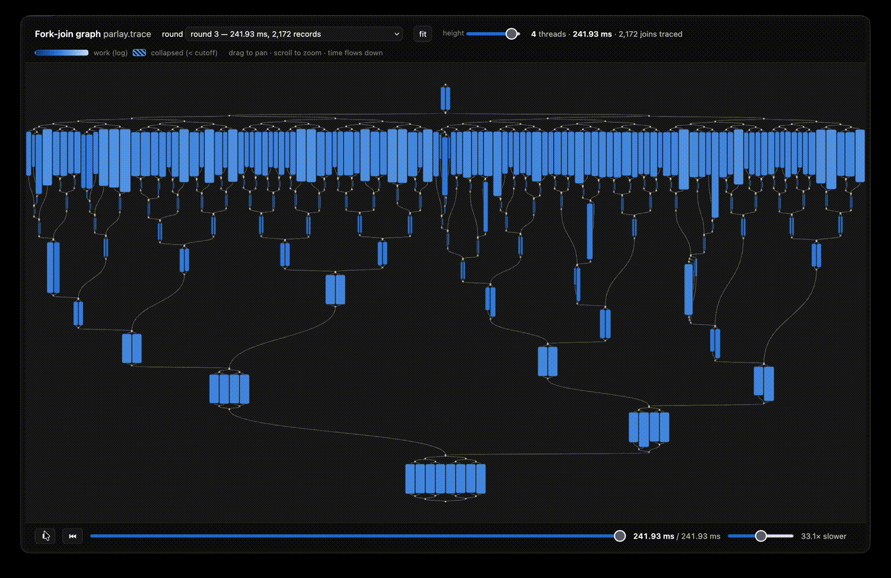

# Scheduler Augmentation: Computation Graph Visualization



This is an application of *scheduler augmentation*, described in the following paper:
> *Scheduler Augmentation: A Lightweight, Customizable, Low-Cost Profiling Technique for Fork-Join Parallel Programs.*
> Sam Westrick, Darshan Dinesh Kumar and Seong-Heon Jung.
> ACM Symposium on Parallelism in Algorithms and Architectures (SPAA) 2026.

This branch (`graph-viz`) offers interactive visualization of the computation graph:
the augmented scheduler traces the fork-join structure of the computation to a file,
and a small tool renders it as a self-contained interactive web page.

# Branches

* [`master`](../../tree/master): the `EvaluationVertex`, measuring work, span, and the number of forks. Reproduces the results of the evaluation section (section 6) of the paper.
* [`grain-analysis`](../../tree/grain-analysis): the `GrainAnalysisVertex` used to perform granularity analysis. Reproduces the granularity analysis section and the parallel range query case study (sections 3 and 3.1) of the paper.
* [`space-profiling`](../../tree/space-profiling): the `SpaceVertex` used to perform space profiling. Reproduces the space profiling section and the quickhull case study (sections 4 and 4.1) of the paper.
* [`graph-viz`](../../tree/graph-viz) (this branch): the graph-tracing Vertex plus the `visualize` tool, for interactive computation graph visualization.

# How It Works

* [`include/parlay/internal/vertex.h`](include/parlay/internal/vertex.h): the custom Vertex. Each vertex carries a deterministic [DePa label](https://arxiv.org/abs/2204.14168) (implemented here: [`include/parlay/internal/depa.h`](include/parlay/internal/depa.h)) identifying its position in the fork-join graph.
* [`visualize`](visualize): reconstructs the series-parallel graph from the trace and writes a self-contained interactive HTML page.

# Example: Mergesort

```bash
cd eval/benchmarks
make bin/mergesort.aug
PARLAY_NUM_THREADS=4 ./bin/mergesort.aug 10000000   # writes parlay.trace
../../visualize parlay.trace                        # opens in your web browser
```

In the viewer: drag to pan, scroll to zoom (more detail appears as you zoom in),
hover any element for its work, fork count, and average work per fork, use the
*height* slider to stretch the layout vertically, and press *play* (or space) to
replay the execution — 10× slower than real time by default, adjustable with the
speed slider.

Environment variables understood by any `.aug` binary:

| Variable | Default | Meaning |
|---|---|---|
| `PARLAY_NUM_THREADS` | all cores | number of worker threads |
| `PARLAY_TRACE_FILE` | `parlay.trace` | where to write the trace |
| `PARLAY_TRACE_CUTOFF_US` | `500` | join-points with less work than this (in µs) are omitted |

The same workflow applies to the other benchmarks in `eval/benchmarks` (build the
`bin/<name>.aug` target).
